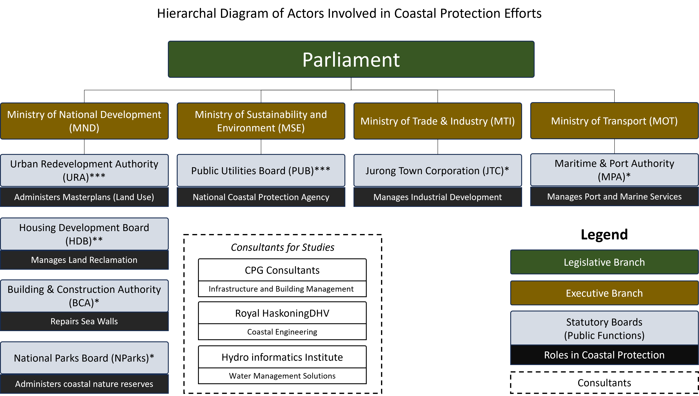
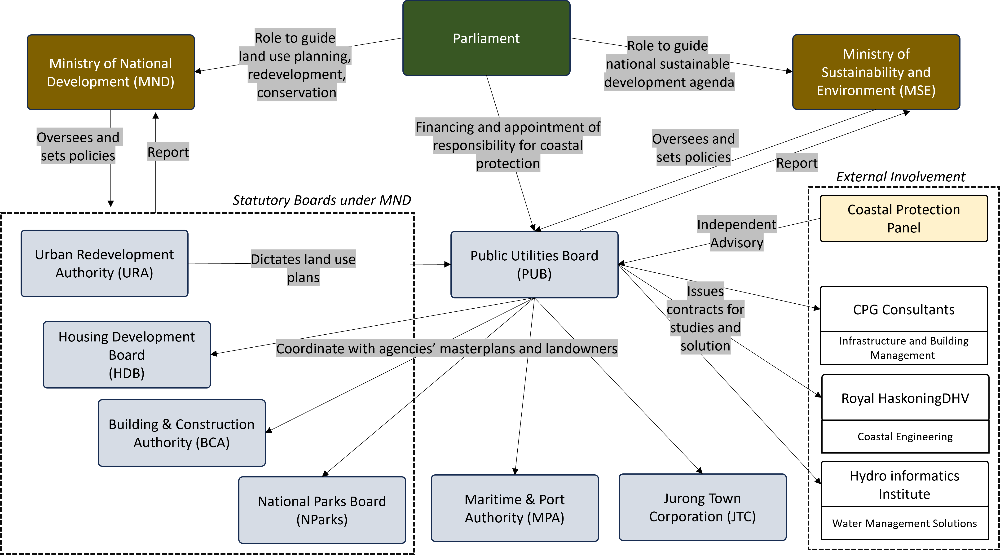

*Diagram: Map of Singapore's City-east coast region, with district maps containing key infrastructrures the government aims to protect.*

*Singapore is a low-lying island and about 30 per cent of its land is less than 5m above sea level. If extreme sea-level scenarios reach 4m to 5m by 2100, our coastlines are at risk. One particular region of concern  is the City-East Coast Area, which is resident dense and contains much of our key infrastructure such as our Main Airport, City Shipping Terminal, and the Central Business District, and has been reported to experience historical cases of floodings.*

*In 2019, the [Prime Minister announced their commitment to protect the coastline](https://www.straitstimes.com/singapore/national-day-rally-2019-100-billion-needed-to-protect-singapore-against-rising-sea-levels) – which marked the start of several planning moves to manage this long-term problem. In this interview, I intend to explore the past, present practices of coastal protection plans, and discuss what the future of water governance in Singapore could look like.*

*Joining me is Dr XXXXXXXX, the Acting Deputy Director of the Coastal & Marine Branch at the National Biodiversity Centre of the National Parks Board (NParks) in Singapore. I believe her experience on working on coastal protection projects from the position of nature would be useful to understand the complexities within water governance.*

*A summary of findings can be found below [here](#reflection-and-discussions).*

Note: Because some of the points mentioned about may be confidential/sensitive, it is impossible to completely validate the facts she mentioned. A source would be hyperlinked for those that could be validated.

## Introduction
**Maybe you can tell me a little bit about your role in government?** I mostly deal with EIAs. My main portfolio is looking at developments that are happening and then assessing whether environmental impact assessments are necessary. Finally, we will walk development agencies through this whole EIA process.

**Could you tell me about the state of planning for coastal protection? And maybe also what is the significance of the City-east coast area?** So currently the Public Utilities Board (PUB) is developing a nationwide strategy for coastal protection. They do this by analysing and breaking up Singapore into basically watersheds where they have to protect the coastline — they are called [Adaptation Planning Areas (APAs)](https://sites.google.com/view/nuscoastalgroup/research/national-coastal-inland-flood-model-for-climate-change) and some are a higher priority that they need to protect from sea level rise, maybe because they're more low lying, or because they have a high density of residence, critical industry and considerations like that. 

The first one that they're really focusing on is from the greater southern waterfront all the way to Changi, including East Coast in between. So, there's the most vulnerable stretch of coastline in Singapore. 

## Roles and Responsibilities

*Diagram: Organizational breakdown of actors involved in coastal protection efforts.*

**You mentioned how the Public Utilities Board (PUB) is taking charge coastal protection – has that always been the case? How did that happen?** The [role of coastal protection moved to PUB](https://www.pub.gov.sg/news/pressreleases/PUBtoleadSingaporescoastalprotectionefforts) because they started to link it with climate change and they realize that they cannot separate the coastal protection from flood protection, and flood protection from inland flood protection. If extreme events of high tides and sea level rises coincides, you cannot pump your water out in time and it's going to cause inland flooding. 

It went originally from Building Construction Authority (BCA), which used to just basically build and repair our sea walls, to PUB so that they could give a more strategic level kind of planning for future coastal protection, especially in the face of sea level rise.

*Diagram: Formal chart of actors. The power to influence decision making lies beyond organizational hierarchy.*

**So, who are the main actors involved in the coastal protection?** The biggest is definitely PUB and their parent ministry MSE will be very involved, that’s first. Then there are the other agencies that deal with planning that involve a lot of the coastline. So NParks is one because you have a coastal park. Urban Development Authority (URA) does a lot of the land planning and also Housing Development Board (HDB) because they do a lot of the land reclamation. So, these three agencies are quite tuned into a lot of the updates. Next are the agencies that own land by the coast - so like Maritime Port Authority (MPA) manages ports with some involvement in some land reclamation, Jurong Town Council (JTC) because they have quite a lot of industry areas near coastlines, like Jurong Island and also Tuas. 

**So how are coastal protection projects financed?** Coastal Protection is under PUB. I think this was announced, like 100 billion or something in the next 100 years for coastal protection. So that goes to PUB, and they are the ones who disperse the funds, and they are still trying to figure out how to disperse the funds when different agencies are doing the protection for different land. So, they're still figuring the mechanisms of that.

## Power Dynamics and Trade-offs
**With so much fragmentation of land ownership between the various agencies in just a single area [City-east coast], how does the government actually manage the land for coastal protection?** The power to change the land usage is very much to help in the URA; they become sort of like an arbiter for different agencies. Different agencies will just want their own tiny kingdom — they will always want to do land grabs all the time to take acquire land. So URA is really there to balance everyone's needs. They usually have a wider and longer-term view than individual agencies because individual agencies only see their own KPIs which tend to be a shorter term while URA will have the grand master plan for the whole of Singapore. And because every agency comes to URA for help, they are always quite aware of everyone’s needs, and they try to balance them. But while also keeping in mind that they are also planning with a certain vision for the rest of Singapore, so they do have their own priorities and agendas.

**Based on your past experiences with coastal projects, was this easy to handle? How do they manage trade-offs – like prioritizing coastal protection goals with other equally important goals?** Yes, I would think so, Singapore is very lucky in that it is a small country. The planning teams in different agencies know each other very well. So, I think there is that close working relationship. But I think that when it comes to the question of trade-offs, someone usually decides what the priority is. 

The overarching priority for Singapore is almost always economic development and housing. Because those are always the main concern for the populace, things like nature preservation which we manage at NParks will never trump them and it is understandable. So even for coastal protection, new plans will gravitate towards this underlying pragmatic narrative. In the past, we were quite used to [losing our original coastal and marine ecosystems for urban development and reclamation](https://www.sciencedirect.com/science/article/abs/pii/S096456911400355X).

**You mentioned how “someone has to decide”. Who really decides?** I‘m not really involved when they give the final say that often? Usually, agencies tend to settle amongst themselves. If all these agencies can’t decide then it goes to Ministry like MND or MSE and sometimes it comes down to the point where the minister himself decides. It is also because these things have political implications.

**I think there could be better ways to negotiate trade-offs than just let one goal from an agency “trump” the other? What do you think?** It’s slowly improving, I think. There are levers for us to insert our points of view in the earlier stages of planning process like [Ecological Profiling Exercise](https://www.ura.gov.sg/-/media/Corporate/Media-Room/2022/Jun/pr22-25h.pdf) where we can highlight things like our ecological connectivity which should really try to maintain in new coastal projects. This would be better than waiting after the plans have been written and finding ways to mitigate. There's still change, but it's happening.

**Are these negotiation processes documented anywhere?** Okay, so the, the reason why there are so few concrete examples of that out there is because by the time it goes public, the government has this whole of government has this “our stand”. So, there's no visible infighting between the agencies, you're not supposed to show that right, because that's ugly, that's back of house things. All that is settled by the time it reaches the public. 

## Planning Processes
 
*Diagram: Visualization of the formal and informal processes in planning as told by the interviewee.* 

**Could you roughly bring me through the planning process?** Sure, it starts off with site specific studies for each Adaptive Planning Areas (APAs), to basically come up with a holistic assessment and solution for coastal protection within regions like City-east coast. For each site, PUB will recommend solutions that integrate protection with other opportunities related to liveability, it could be like maybe a promenade — essentially a system solution that includes recreation, industry or education.

So, they work very closely with the other agencies when they're doing planning along each stretch of coastline because different agencies own the plot, right? At the end of the day, they have a continuous line of protection across the whole of Singapore, at least eventually. 

**I’m a little confused by the actual process. I get that the site studies are the starting point, but what happens between the studies and implementation?** Right okay, it does seem to be confusing because they’re all moving at the same time. So, within the coastal protection team, they have a master planning team to develop strategies at a national level. Right? They're saying things like — okay, we need absolute protection, a line where beyond which water cannot intrude, something like that. They are trying to come up with general guidelines for the whole of Singapore. 

Then you have the teams that are dealing with the APA’s. So, it’s kind of the on-the-ground type of planning, they are doing studies to inform their detailed plans and how to develop that. So, both are happening at the same time. But ultimately, the master planning and all guidelines will inform the local APA regional plans. 

But because of the urgency of the timeline, at least for the City-east coast region, the specific study has already gone ahead. So as and when the master planning team comes out with certain guidelines, then they will try to put it as part of their regional planning as well. But hopefully by the time other APAs come online, the whole master planning and strategy will have been solidified now. There will eventually be official legislation and official policies that will come on, but the legislation takes much longer than that. Because of the urgency of coastal protection, they can’t afford to wait for legislation to be out before they start work.

**Can you tell me about the existing regulatory frameworks used or is it going to be something formed by working backwards? What do you think about it.** Internally, they are developing it now, but there’s a consensus that it has to be based on science. If you google [“PUB Research Fund”](https://www.pub.gov.sg/globalhydrohub/funding/cwr), they are coming up with millions and millions of dollars of research funding to help them address a lot of the knowledge gaps before they can move forward. However, their in-house planning team is developing certain guidelines for coastal protection that all the agencies have to agree to. So, there will be frameworks, but it just hasn’t come online yet.

## Stakeholder Engagements
**Is it me or are the information about new coastal projects quite inaccessible?** The problem with a lot of the coastal projects is that the EIA is or not publicly available, because of security issues in Malaysia. So a lot of the coastal projects have like Malaysia would, I think there's always a worry that Malaysia will try to take the data and use it against us because we share waters. So usually, it's quite hard to find EIAs like published on marine projects. 

**Does this pose a problem for the involvement of stakeholders in new coastal projects?** Yes and no. Engagement in Singapore tends to be very (informing rather than consulting in developments)[https://link.springer.com/article/10.1007/BF02905122]. Even when they try to be consultative now, they don’t consult as much as they should because they want to be efficient.

**To clarify, when in the planning process it does actually happen?** It happens much, much further downstream at the implementation stage after the EIA is done. Before they start constructing, then they tell people. 

**So even on an EIA Level, there’s not much of an engagement?** But the engagement is only after the development has already been planned. The EIA is mostly to mitigate the impacts, but the EIA cannot conclude that this development cannot be done. So it's because it is only about mitigation, there's very little the public can do anything. By the time they hear about it, it is already in URA’s masterplan. And it is often believed that URA really took into account all the considerations, nature considerations, housing considerations, economic considerations, and this is the best place to do things. And their [plans happen in such a long-time scale](https://www.ura.gov.sg/Corporate/Planning/Our-Planning-Process/Long-Term-Planning) – the Concept Plan is like 15 years and the Master Plan is 10 years. 

**Do you think that this harms the legitimacy of planning decisions?** That is, to me, that is one of the major failings — like I feel that more and more we need to bring people out into the planning process. But that will also require a cultural shift within the government. I feel that engagement and consultation should happen at the Draft and the Master Plan stage, which they are trying to do. Currently, we might tweak it a bit, but it's broad strokes, it's very hard to change. This is something that can be worked on.

**Do you think it’s very intentional way of doing things, or is it rooted in our culture?** I think it's really both. It is not in our culture to engage civil society, or really in our governance structure in the past. If you look at your, your first-generation leaders, they are the ultimate top-down, “get things done quickly” kind of governance, and that might have worked for us in the 50s, 60s and 70s. But, you know, as the society evolves, and as our land use evolves, this is becoming not the best way to govern. 

So, the government is slowly changing, but I think you can see some changes through consultation programmes like TogetherSG and you will never have seen in the 60s. I think they're moving for something that's more superficial type of consultation. Hopefully to have more really proper and deep process where people are involved in decision making and policymaking in the future. It will take a while for us to get there. We need to get used to that kind of, you know, working style.

## Monitoring and Evaluation

*Diagram: Interpretation of Social Learning based on Monitoring and Evaluation practices as told by the interviewee.*

**Moving on, I would like to know more about Monitoring and Evaluation and how is it typically conducted in coastal projects.** On the very basic development project level, we have environmental management and monitoring plans (EMMPs). So, where there is a development, there'll be a monitoring and management to make sure that there is no there is no damage to the environment as predicted by the EIA. So, everything is going to plan, right. But if you're talking about like much larger kind of evaluation of big scale projects, I feel even if they do, they don't share it. Unless it's a success story, if you get what I mean.

**So that is the part that I have always been unsure – because I don’t often encounter any forms of formal reviews published about past water projects, I’m not quite sure if it exist, or its confidential. What do you think?**  To be honest, I don't think it's common. Because yeah, I don't see it being scoped in officially with people or even talked about when people are planning development projects. They always talk about the endpoint, and it seems to be to build the thing. And then that's it. I cannot think offhand of many projects where they actively monitored after its built to ensure that it performs. 

We keep track of the data, but I don’t think we keep that it minds in future projects. But I don't think it is consciously part of the development cycle, if that's what you're asking that. Yeah, the development cycle ends at the end of development.

**Do you think there is a need for an improvement to effectively manage the coastlines?**I mean, better monitoring is clearly one. But you're talking about, like many, many years down the road. PUB’s main concern is that there's no flooding. So, they will be monitoring that and I’m confident that whatever they build is not going to allow Singapore to flood. 

But if we are trying to build these integrated solutions that have multiple benefits for, health and recreation and all that, we need to find some way to monitor it. I think there's a question of who is going to do it, if you bring that up? Everyone’s KPI ends at building the thing.

The iterative process where you learn from it and then you build again is not done often. Maybe it's done informally, like the designers who saw it through, informs that we should do them differently the next time, but it's not something that is built into the process in the ways they record the document, and then they use it for the next cycle of planning. 

## Reflection and Discussions

The discussion about water governance has opened the conversation about a broader governance structure that influences coastal management practices. We can see that some of the stregnths of such a structure is conversely also the reason for some weaknesses.

**Efficient and Science-focused Governance.**
Singapore’s efficient organizational structure and integrated approach is effective in planning for coastal protections. Even with such a centralized form of governance, the focused areas are decentralized (through Adaptation Planning Areas) and dealt with separately with respect to their unique needs and land characteristics. 

It is quite respectable that Singapore works very closely with academic and consultants to ensure that plans and policies are grounded. There is also much coherence in the operational aspect of things within the government. Singapore has really made use of its small stature and allow for great cross-sectorial interaction and collaborations. There are much informal processes that drives the whole planning process, and this allows the plans to keep up with the urgency of climate change issues. The strong system logic existent within the agencies allows for such applaudable performances.

**Power Structures, Manging Trade-offs and Legitimacies.**
However, this system logic is also the cause of other drawbacks. With Singapore’s historical legacy of rapid economic development, it seems that some of these priorities lingers within the current government system. This is additionally reinforced by the informal power structures where key agencies/individuals have control over trade-offs. There runs a risk where the use of science could be biased towards specific frames of those who are in power.

Generally, this might often allow for more amicable collaborations within the government, but it is quite clear that especially in more complex issues like land-hungry coastal protection projects, managing planning trade-offs should be more meticulous.

Even with the track-record of producing great results in water management, the government begin to encounter difficulties with ensuring the legitimacies of plans due to lacking practices in stakeholder engagement especially with regards to sensitive matters like land use. With such a culture of efficiency and KPI-orientedness, efforts to include civil society more into the planning process is hindered. The solution will not be as easy as organizing more talks, but it requires a real cultural structural shift within the government to understand that public voices should be valued in planning cycle and to do that without compromising the effectiveness and efficiency that exists.

**Social Learning within Governance.**
This brings to the last point about the importance of social learning with the government. It is clearly that some of the issues lies in the inability to revise organization structures based on changing contexts.

From the interview, much of social learning within the government comes from very informal means such as key appointment holders and designers learn from their involvement in project. However, this might not be enough as even though it exists, it is rather slow, and it always depends on few individual to seed the change in the governance system. There is a stronger need for more formal mechanisms within the government to build reflexive capacities — where results can be reviewed and governance can evolve in the long-term to deal with the changing world.